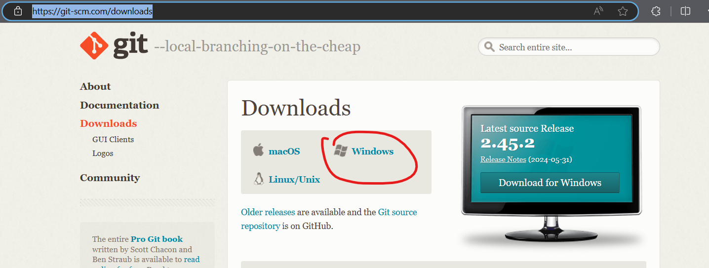

# ManageWise

<p align="center">
  
</p>

<p align="center">
  ManageWise is an FYP project of Politeknik Kuching Sarawak Student. This project aims to enhance user productivity by applying automation to repetitive tasks that users perform regularly.
</p>


---

# Introductions hello

Yokoso Mina-sama. sitok la kita akan share, submit and pull project, mainly semua kt sitok.

aku yakin takrang xbiasa dengan github and stuff, memandangkan mood saya adalah menulis, aku akan karang usage of it.

<div align="center">
  
</div>

## How To get start and run the program

1. First, we need to download node.js since we gonna be using **react.js**
```sh
https://nodejs.org/en/download/prebuilt-installer
```

2. After you downloaded node.js, you can just install it normaly, we need it for `npm` and `npx`

3. since we also need to use github, we need github utility, simply download and install `git`
```sh
https://git-scm.com/downloads
```


4. Nice, you now can access git command, create a folder where you want to store all of your work. **I recommend you name it `FYP`**, get inside the folder **and go to this locations** and execute this command **`cmd`**


5. Now you can download this project. To download this project, copy this command and past it on the command prompt:
```sh
git clone https://github.com/ismasalalu/ManageWise.git
```

## First Time Initialize 

well, the first time you run the project you need to utelize it first:

1. Do the thing at installations **step 4** and run:
```sh
# npm reffer to (Node Package Manager), i = install
npm i
```

## run project

Now we can start the project:

1. There are a few command available, a few of it is:

- `start` : used to start the project
- `build` : used to build the project to optimize version 
- `test`  : used to test the project (for now there are nothing to be test) 
- `eject` : Remove the abstractions provides by CRA (100% not recomended)

2. well, thats the back-end developer jobs. but its okey, **to start the project, do the same at `step 4` installations then run this command**
```sh
npm run start
```

---

## How to connect Github With your local machine

1. **Configure Git**: Set your global username and email
```sh
git config --global user.name "Your github name"
git config --global user.email "your-github-email@example.com"

```

2. **creating ssh key for github**: you need to create public and private key and share it to github:
```sh
ssh-keygen -t rsa -b 4096 -C "your-email@example.com"
```
3. **Uploding the public key to github to get the access**
```sh
# on your local machine
c: > user > {your name} > .ssh > {for example: id_ed25519.pub} - open it with notepad and copy the content, it must start with ssh-ed25519 and end with your email

# Pasting the public key on github
https://github.com/settings/profile > SSH and GPG keys > new ssh keys > put your title and past the key 
```

3. **Test for the success of not**
```sh
# run this command on command prompt
ssh -T git@github.com
yes
```

---

## How to manage your github

## To update your local code:
```sh
git checkout master
git pull
```

## Working with temporary branch (the one with issue id):
```sh
# to create unexisting branch
git checkout -b {branch ID}
```

## Update your local code-base BEFORE UPLOAD:
```sh
# update your code-base
git add . 

# Add comment of what have you done
git commit -m "{Message of what have you done}"
```

## To upload to temporary branch
```sh
# First time upload to the temporary branch
git push --set-upstream origin {branch ID}

# Not First time
git push
```


## !!!!! How to merge your changes to MASTER !!!!!

### ---------------------------
### | !!!!!! IMPORTANT !!!!!! |
### ---------------------------
### YOU CAN ONLY MERGE THE IF THE CODE IS 100% DONE AND ERROR FREE !!!!!

1. First you need to save the changes to `your local database` on `your own branch`. Do thing on `How to submit your work`

2. Change your `working brench` to `master`
```sh 
git checkout master
```

3. Then sent the merge request to the `admin (in this case izz is the admin)`. 
```sh
git merge {your working brench}
```

4. Chat or wait for admin to approve the merge, do not self aprove the merge since it need percousions and deeper look into it
   

### If There any issue about this git repo, can directly contact me for more info


### THIS PROJECT IS UNFINISH AND STILL UNDER RAPID DEVELOPMENT. WE DONOT RECOMMEND ANYONE TO RUN IT SINCE THIS IS OUR FYP PROJECT AND NEED TO BE CREATE AND FIX BY OUR OWN TEAMS

**Huge shout-out to our team that was involve in this project**

<p align="center">
  
</p>
