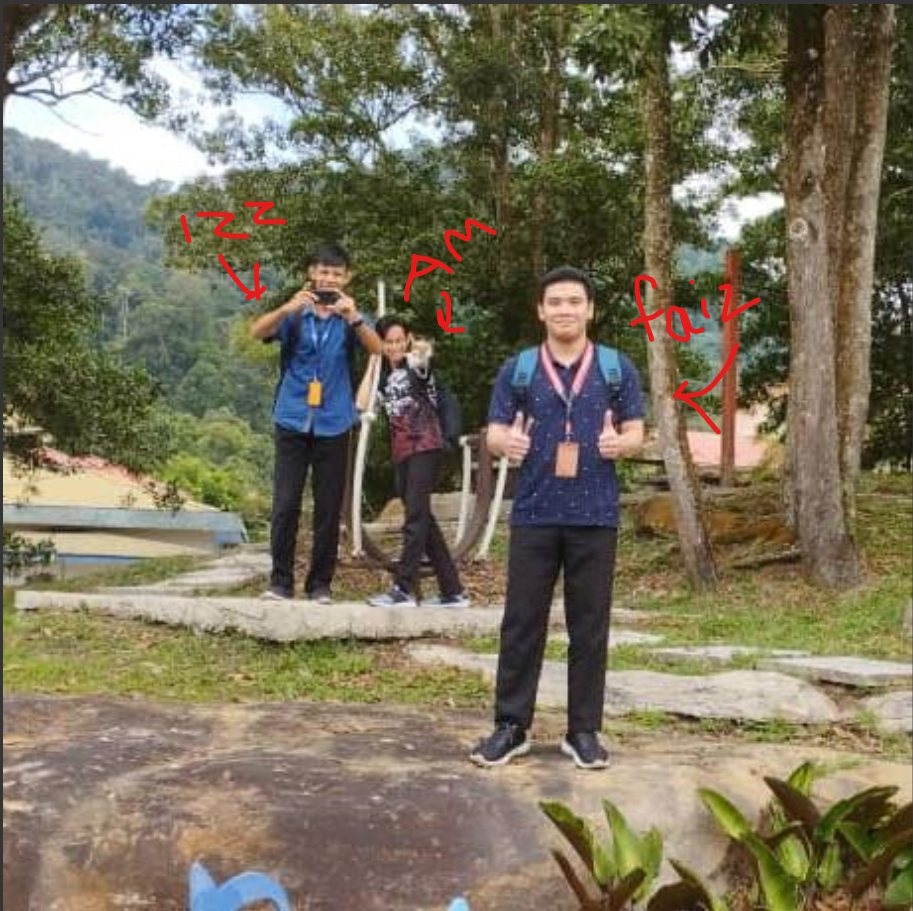

# ManageWise

<p align="center">
  
</p>

<p align="center">
  ManageWise is an FYP (Final Year Project) developed by students from Politeknik Kuching Sarawak. This project aims to enhance user productivity by automating repetitive tasks.
</p>

---

## Getting Started

### Prerequisites

- [Node.js](https://nodejs.org/) (LTS version recommended)
- [Git](https://git-scm.com/)

### Installation

1. Clone the repository:
   ```sh
   git clone https://github.com/ismasalalu/ManageWise.git
   ```

2. Navigate to the project directory:
   ```sh
   cd ManageWise
   ```

3. Install dependencies:
   ```sh
   npm install
   ```

### Running the Project

To start the development server:
```sh
npm start
```

This will run the app in development mode. Open [http://localhost:3000](http://localhost:3000) to view it in your browser.

## Available Scripts

In the project directory, you can run:

- `npm start`: Runs the app in development mode
- `npm test`: Launches the test runner
- `npm run build`: Builds the app for production
- `npm run eject`: Ejects from Create React App (one-way operation)

## Backend Server

The backend server for this project can be found at:
[https://github.com/ismasalalu/ManageWise-Backend](https://github.com/isma27k/ManageWise-Backend)

## Contributing

Please read [CONTRIBUTING.md](CONTRIBUTING.md) for details on our code of conduct and the process for submitting pull requests.

## Git Workflow

1. Update your local master:
   ```sh
   git checkout master
   git pull
   ```

2. Create a new branch for your feature:
   ```sh
   git checkout -b feature/your-feature-name
   ```

3. Make your changes and commit:
   ```sh
   git add .
   git commit -m "Description of your changes"
   ```

4. Push your branch:
   ```sh
   git push -u origin feature/your-feature-name
   ```

5. Create a Pull Request on GitHub for review.

## Important Note

This project is under active development. We do not recommend running it in a production environment without thorough testing and approval from the project maintainers.

## Team

<p align="center">
  
</p>

A huge thank you to all team members involved in this project!

## License

This project is licensed under the MIT License - see the [LICENSE.md](LICENSE.md) file for details.
