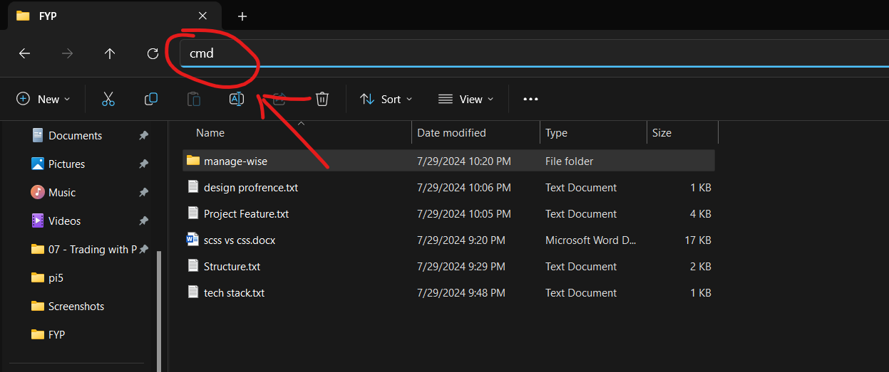

# ManageWise

<p align="center">
  
</p>

<p align="center">
  ManageWise is an FYP project of [...] group. This project aims to enhance user productivity by applying automation to repetitive tasks that users perform regularly.
</p>


---

# Introductions

Yokoso Mina-sama. sitok la kita akan share, submit and pull project, mainly semua kt sitok.

aku yakin takrang xbiasa dengan github and stuff, memandangkan mood saya adalah menulis, aku akan karang usage of it.

<div align="center">
  
</div>

## Lets start

1. first kau kenak download Node.js since kita akan guna **react.js**
```sh
# pergi dolok kau ke link tok untuk download node.js
https://nodejs.org/en/download/prebuilt-installer
```

2. selepas kau download node.js, kau boleh install macam bisa, kita perlukanya sebab `npm` n `npx`

3. pasya disebabkan kau perlu menggunakan github and stuff, kau kenak juak download git
```sh
https://git-scm.com/downloads
```


4. nice, kinik kau dah boleh access command git clone, kinik aku maok kau create folder untuk kau **simpan semua kerja-kerja kau**, masok dalam ya pasya **pergi ke location** and taip **cmd**


5. sekarang barulah kau boleh download benda tokk.... clone kan repository tok ke file kau guna command tok:
```sh
git clone https://github.com/ismasalalu/ManageWise.git
```

## first time initialize 

well, kau xkan semudah ya jak run project tok, kau kenaak initializee dolok

1. gedak kt installation **step 4** ya, bukak cmd kt folder kerja pasya run:
```sh
# npm ya merujuk kepada (Node Package Manager), i = install -y = yes
npm i -y
```

## run project

yahhh, dapat polah kawan, jom run gik

1. ada beberapa command untuk project tok, antaranya:

- `start`: used to start the project
- `build`: used to build the project to optimize version (100% not recomended)
- `test` : used to test the project (for now there are nothing to be test) 

2. well, ya kerja back-end developer. but its okey, **Untuk start project, sama juak buat step 4 installation pasya run command tok**
```sh
npm run start
```

dah siapp, xsusah kan hahhha

---

## How to connect Github With your local machine

1. **Configure Git**: Set your global username and email
```sh
git config --global user.name "Your github name"
git config --global user.email "your-github-email@example.com"

```

### mun ada apa-apa boleh roger aku


# Well, benda tok x siap agik, klak aku sombung tulis gik untuk cara pull and commit req

# THIS PROJECT IS UNFINISH AND STILL UNDER RAPID DEVELOPMENT. WE DONOT RECOMMEND ANYONE TO RUN IT SINCE THIS IS OUR FYP PROJECT AND NEED TO BE CREATE AND FIX BY OUR OWN TEAMS

**Huge shout-out to out team that was involve in this project**

**dah siap dooo**